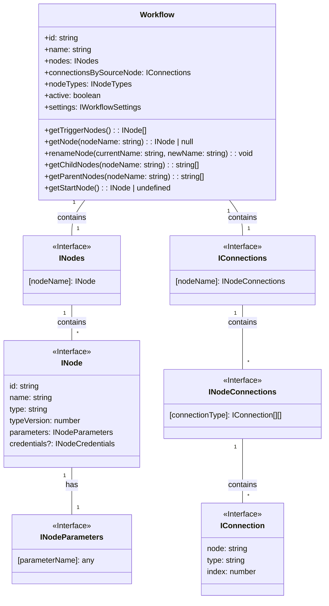

# コード構造の分析レポート

## 1. 重要なコンポーネント: `n8n-workflow` パッケージ

`n8n-workflow` パッケージは、ワークフローのデータ構造定義、状態管理、実行ロジックの根幹を担う、プロジェクトで最も重要なコンポーネントの一つです。本レポートでは、このパッケージの中心である `Workflow` クラスとその関連データ構造に焦点を当てて分析します。

## 2. ソフトウェア構成およびコード構造の詳細分析

### 2.1. 主要クラスとインターフェース

`packages/workflow/src/` ディレクトリ配下のソースコードを分析した結果、中心となるのは `Workflow` クラスと、それを構成する `INode` および `IConnections` インターフェースであることが判明しました。

*   **`Workflow` クラス (`workflow.ts`)**:
    *   ワークフロー全体のコンテナとして機能します。
    *   ワークフローに含まれる全てのノード (`INode[]`) と、それらの接続情報 (`IConnections`) をプロパティとして保持します。
    *   ワークフローの開始ノードの特定、ノード名の変更、親子関係の走査など、ワークフロー構造を操作するための多様なメソッドを提供します。

*   **`INode` インターフェース (`interfaces.ts`)**:
    *   ワークフローを構成する個々の「ブロック」であるノードを定義します。
    *   `name`, `type`, `parameters`, `credentials` などのプロパティを持ち、ノードの振る舞いやユーザーによる設定値を保持します。

*   **`IConnections` インターフェース (`interfaces.ts`)**:
    *   ノード間の接続情報を定義します。
    *   「どのノード」の「どの出力」が、「どのノード」の「どの入力」に接続されているか、という情報を階層的なオブジェクトで表現します。

### 2.2. クラス図 (Mermaid記法)

`Workflow` クラスと主要な関連インターフェースの関係性をクラス図として以下に示します。

この図は、`Workflow` が `INodes` と `IConnections` を介して、多数の `INode` とそれらの接続情報を集約・管理していることを示しています。

### 2.3. 依存関係とデータの流れ

`n8n-workflow` パッケージは、他の主要パッケージと以下のように連携して動作します。

*   **`n8n-core` (→ `n8n-workflow`)**:
    *   `n8n-core` は、HTTP通信や認証といった低レベルな機能を提供します。`n8n-workflow` 内のロジック（特に個々のノードの実行時）は、これらのコア機能を利用して外部サービスとの連携を実現します。

*   **`n8n-nodes-base` (→ `n8n-workflow`)**:
    *   `n8n-nodes-base` は、`INode` インターフェースの具体的な実装を提供します。例えば、「HTTP Requestノード」や「Slackノード」のロジックはここで定義されます。
    *   ワークフローが実行される際、`n8n-workflow` の実行エンジンが `Workflow` オブジェクトの構造を解釈し、`n8n-nodes-base` で定義された各ノードの処理を適切な順序で呼び出します。データはノードからノードへと `IConnections` で定義された接続に従って渡されます。

つまり、`n8n-workflow` はワークフローの「設計図」とその「実行監督」の役割を担い、`n8n-core` は「道具箱」、`n8n-nodes-base` は「個々の作業内容」と例えることができます。
