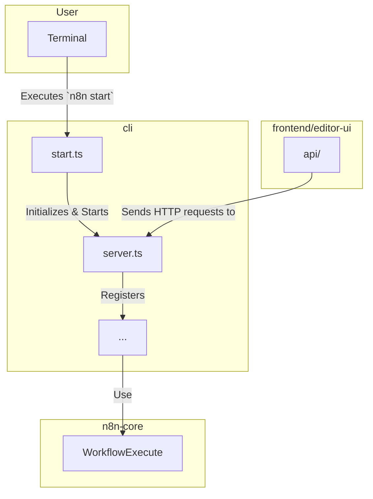

# パッケージ: `cli`

## 1. 概要

`cli`パッケージは、n8nアプリケーション全体の**エントリーポイントであり、バックエンドの司令塔**です。当初の想定とは異なり、このパッケージは単なるコマンドラインインターフェースのラッパーではなく、サーバーの起動、データベース接続、DIコンテナの初期化、各種サービスの統合、アクティブなワークフローの実行管理など、バックエンドアプリケーションの初期化と起動に関するほぼすべての責務を担っています。

`n8n start`や`n8n worker`といったコマンドは、このパッケージによって解釈され、対応するサーバープロセスやワーカープロセスを起動します。

## 2. 主要なコンセプトとアーキテクチャ

`cli`パッケージは、`commander.js`をベースとしたコマンドパーサーと、アプリケーション本体を起動するロジックで構成されています。

### 2.1. `commands/start.ts`

`n8n start`コマンドが実行された際のメインの処理を定義するファイルです。

-   **責務:**
    -   コマンドラインフラグ（例: `--tunnel`）をパースします。
    -   `Server`クラス (`@/server.ts`) をインスタンス化し、HTTPサーバーを起動します。
    -   DIコンテナを初期化し、データベース接続、ライセンス検証、外部フックの読み込みなど、アプリケーションに必要なサービスを準備します。
    -   `ActiveWorkflowManager`を初期化し、アクティブなワークフローのトリガーやポーリングを開始させます。
    -   プロセス終了シグナル（`SIGINT`, `SIGTERM`）を捕捉し、安全なシャットダウン処理（`stopProcess`）を実行します。

### 2.2. `server.ts`

Express.jsをベースとしたWebサーバーの実装です。

-   **責務:**
    -   REST APIのエンドポイントを定義するコントローラーを登録します。
    -   フロントエンド（`editor-ui`）の静的ファイルを提供するためのミドルウェアを設定します。
    -   WebSocket接続をハンドリングし、リアルタイム通信（例: 実行状況の更新）を実現します。
    -   認証やCORSなどのセキュリティ関連のミドルウェアを設定します。

### 2.3. `main` と `client` パッケージについて

当初の分析では、`main`（アプリケーションコア）と`client`（APIクライアント）という独立したパッケージが存在すると推測していましたが、これは**誤り**でした。

-   **`main`**: `main`パッケージに相当する責務（アプリケーションの初期化とモジュールの統合）は、`cli`パッケージ内の`commands/start.ts`や`server.ts`に完全に統合されています。
-   **`client`**: フロントエンドが利用するAPIクライアントは、独立したパッケージではなく、`frontend/editor-ui/src/app/api/`ディレクトリ内に直接実装されています。

## 3. ディレクトリ構造

`packages/cli/src/`ディレクトリ下の主要なファイルと責務は以下の通りです。

```
packages/cli/src/
├── commands/               # `start`, `worker`など、各コマンドの実装
│   └── start.ts            # `n8n start`コマンドのエントリーポイント。アプリケーションの初期化と起動。
├── server.ts               # Express.jsベースのWebサーバーの実装。
├── credentials/            # 資格情報に関連するAPIコントローラーやサービス。
├── executions/             # ワークフロー実行に関連するAPIコントローラーやサービス。
├── workflows/              # ワークフローのCRUD操作に関連するAPIコントローラーやサービス。
├── config/                 # `config`ライブラリを使った設定管理。
├── databases/              # データベース接続とマイグレーションの管理。
└── services/               # アプリケーション全体で利用される各種サービス。
```

## 4. 他パッケージとの関連



-   **`n8n-core`**: `cli`パッケージ内の各種サービス（例: `WorkflowRunner`）やコントローラーは、リクエストに応じて`n8n-core`の`WorkflowExecute`クラスを呼び出し、実際のワークフロー実行をトリガーします。
-   **`frontend/editor-ui`**: フロントエンドアプリケーションは、`cli`が起動した`server.ts`が公開するREST APIエンドポイントに対してHTTPリクエストを送信することで、バックエンドと通信します。

## 5. 開発者向けガイド

-   **新しいAPIエンドポイントを追加する場合**:
    1.  `controllers/`ディレクトリに新しいコントローラーファイルを作成するか、既存のコントローラーにメソッドを追加します。
    2.  `server.ts`の`start`メソッド内で、新しいコントローラーがDIコンテナに登録され、Expressアプリケーションに適用されるように設定します。
-   **起動時の処理を追加する場合**: `commands/start.ts`の`init`または`run`メソッドに処理を追加することを検討してください。データベースのマイグレーションや、外部サービスとの接続初期化などが該当します。
-   **バックエンド全体に関わる設定を追加する場合**: `config/`ディレクトリ内の設定ファイルに新しい設定項目を追加し、それを`start.ts`や他のサービスから参照するようにします。
