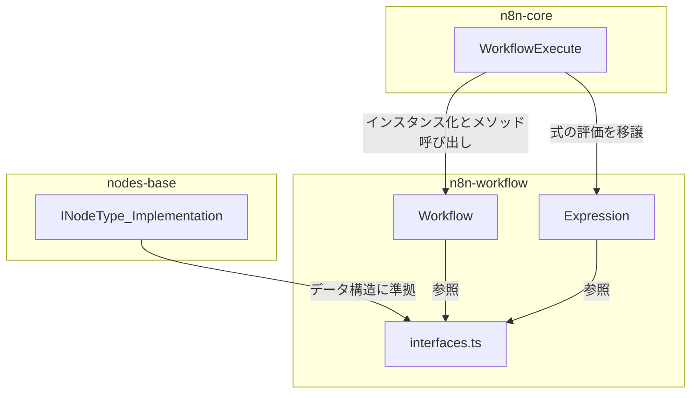

# パッケージ: `n8n-workflow`

## 1. 概要

`n8n-workflow`パッケージは、n8nにおけるワークフローの**静的な定義と構造**に特化した責務を担います。ワークフローが「どのようなノードで構成され、それらがどう接続されているか」という設計図そのものを表現し、操作するためのクラスやインターフェースを提供します。

このパッケージは、ワークフローの実行ロジック（`n8n-core`）から明確に分離されており、アプリケーション全体の見通しの良さと保守性の向上に貢献しています。

## 2. 主要なコンセプトとアーキテクチャ

`n8n-workflow`の中心的な役割は、`Workflow`クラスと`Expression`クラスによって担われています。

### 2.1. `Workflow` クラス (`workflow.ts`)

ワークフローの「静的な骨格」を定義するクラスです。

-   **責務:**
    -   ワークフローを構成する全ての要素（ノード、接続、設定など）をオブジェクトモデルとして保持します。
    -   ワークフローの構造を安全かつ効率的に操作するためのAPI（例: `renameNode`, `getChildNodes`, `getParentNodes`）を提供します。
-   **特徴的な実装:**
    -   **効率的なデータアクセス:** ノードを名前をキーにしたオブジェクトで、接続情報を出力元・入力先の両方をキーにしたオブジェクトで保持することで、グラフの上流・下流双方への高速な探索を可能にしています。
    -   **整合性の維持:** `renameNode`メソッドは、単にノード名を変更するだけでなく、他のノードのパラメータで使われている式（Expression）の中の参照（例: `{{ $node["oldName"].json.id }}`）も自動で`newName`に更新します。これにより、UI上での操作がワークフロー全体の整合性を壊すことを防ぎます。

### 2.2. `Expression` クラス (`expression.ts`)

ワークフローの骨格に「動的な魂」を吹き込むクラスです。ノードのパラメータに埋め込まれた`={{ ... }}`という形式のJavaScriptベースの式を評価する責務を担います。

-   **責務:**
    -   式の実行環境を安全なサンドボックスとして提供します。
    -   ワークフローの実行コンテキスト（他のノードのデータなど）にアクセスするためのインターフェースを提供します。
-   **特徴的な実装:**
    -   **サンドボックス化:** `initializeGlobalContext`メソッドは、式の実行環境で利用可能なグローバルオブジェクトや関数を厳格に制限します。`eval`や`fetch`, `setTimeout`といった潜在的に危険な関数は無効化され、安全なユーティリティとn8n独自のヘルパー関数のみが許可されます（許可リスト方式）。
    -   **`WorkflowDataProxy`:** `resolveSimpleParameterValue`メソッド内で`WorkflowDataProxy`をインスタンス化します。このプロキシオブジェクトが、式の中から`$json`や`$node`といった特別な変数を通じて、現在の実行コンテキストのデータ（上流ノードの実行結果など）にアクセスするための安全な架け橋となります。

## 3. ディレクトリ構造と主要ファイル

`packages/workflow/src/`ディレクトリ下の主要なファイルと責務は以下の通りです。

```
packages/workflow/src/
├── workflow.ts          # Workflowクラスの定義。ワークフロー全体の構造を管理。
├── expression.ts        # Expressionクラスの定義。動的な式の評価を担当。
├── interfaces.ts        # INode, IConnectionなど、パッケージ全体で使われる型定義。
├── common/              # getChildNodesなど、グラフ探索に関する共通ユーティリティ関数。
├── constants.ts         # STARTING_NODE_TYPESなど、マジックナンバーや定数を定義。
├── errors/              # パッケージ固有のカスタムエラークラス。
└── graph/               # グラフ構造に特化した操作やアルゴリズム（現在は`common`が主）。
```

### 3.1. 主要ファイルの詳細

-   **`workflow.ts`**:
    -   `Workflow`クラスを定義します。
    -   コンストラクタで、ノードリストと接続情報を受け取り、内部で高速にアクセスできるデータ構造（オブジェクトマップ）に変換します。
    -   ワークフローの構造を問い合わせたり（`getTriggerNodes`, `getParentNodes`）、変更したり（`renameNode`）するためのメソッド群を提供します。

-   **`expression.ts`**:
    -   `Expression`クラスを定義します。
    -   `resolveSimpleParameterValue`と`getParameterValue`が中心的なメソッドで、式の文字列を実際の値に解決（評価）します。
    -   内部で`expression-evaluator-proxy`を利用し、安全なサンドボックス環境で式のコードを実行します。

-   **`interfaces.ts`**:
    -   n8nのデータフローの基本単位となる`INode`, `INodeExecutionData`, `IConnection`などのTypeScriptインターフェースを定義しています。
    -   このパッケージだけでなく、`n8n-core`や`nodes-base`など、多くのパッケージから参照される、n8nのデータ構造の基礎となるファイルです。

-   **`common/index.ts`**:
    -   `getChildNodes`, `getParentNodes`, `getConnectedNodes`など、ワークフローの接続情報をグラフとして扱い、特定のノードからの上流・下流を探索するためのユーティリティ関数が実装されています。これらの関数は`Workflow`クラスのメソッドから利用されます。

## 4. 他パッケージとの関連



-   **`n8n-core`**: ワークフロー実行エンジンである`WorkflowExecute`クラスが、`Workflow`クラスをインスタンス化して、実行すべきノードのリストを取得したり、接続をたどったりします。また、ノードのパラメータを評価する際には`Expression`クラスの機能を利用します。
-   **`nodes-base`**: すべてのノード実装は、`n8n-workflow`の`interfaces.ts`で定義された`INodeType`や`INode`といったインターフェースに準拠する必要があります。これにより、実行エンジンがすべてのノードを同じように扱うことが可能になります。

## 5. 開発者向けガイド

-   **ワークフローの構造を操作したい場合**: `Workflow`クラスのメソッドを利用してください。`connectionsBySourceNode`や`connectionsByDestinationNode`を直接操作するのは、整合性が崩れるリスクがあるため避けるべきです。
-   **新しい式のヘルパー関数を追加したい場合**: `extensions/extended-functions.ts`に新しい関数を追加することを検討してください。これにより、すべての式の中からカスタム関数を呼び出せるようになります。
-   **データ構造を確認したい場合**: まず`interfaces.ts`を確認してください。n8nの基本的なデータモデルが定義されています。
