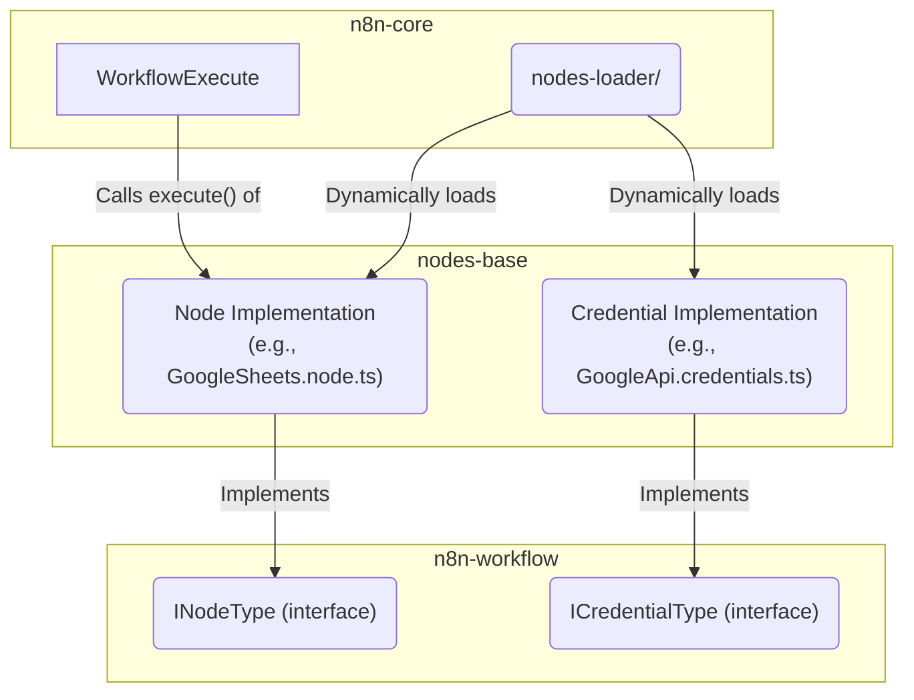

# パッケージ: `nodes-base`

## 1. 概要

`nodes-base`パッケージは、n8nの**拡張性の核**となるパッケージです。400を超える外部サービスとの連携を実現するための「ノード」と、それらが利用する「資格情報（Credentials）」の具体的な実装がすべてこのパッケージに集約されています。

新人エンジニアが新しいサービス連携を追加する場合や、既存の連携機能を改修する際に、最も主要な作業場所となります。

## 2. 主要なコンセプトとアーキテクチャ

`nodes-base`のアーキテクチャは、**規約に基づいた実装パターン**によって標準化されています。すべてのノードと資格情報は、`n8n-workflow`パッケージで定義された特定のインターフェースを実装する必要があり、これによりn8nのコアシステムがそれらを一貫した方法で読み込み、実行することが可能になっています。

### 2.1. ノード (`nodes/`)

各ノードは、`n8n-workflow`の`INodeType`インターフェースを実装したクラスとして定義されます。

-   **責務:**
    -   **UIの定義:** `description`プロパティを通じて、ノードのプロパティパネルに表示されるUI要素（入力フィールド、トグル、ドロップダウンなど）を定義します。
    -   **実行ロジックの提供:** `execute`メソッドを通じて、ワークフロー実行時に呼び出される実際の処理ロジックを実装します。
    -   **補助機能の提供:** `methods`オブジェクトを通じて、UI上で必要とされる補助的な機能（例: 認証テスト、動的な選択肢の読み込み）を提供します。

-   **実装パターン（Google Sheetsノードの例）:**
    -   **バージョン管理:** `GoogleSheets.node.ts`のように、`VersionedNodeType`を継承したクラスでノードのバージョンを管理します。
    -   **ロジックの分離:** 実際のロジックは`v2/GoogleSheetsV2.node.ts`のようなバージョンごとのファイルに実装されます。
    -   **関心の分離:** `GoogleSheetsV2.node.ts`では、UI定義（`versionDescription`）、実行ロジックの振り分け（`router`）、UI補助機能（`methods`）が明確に分離されており、見通しの良い構造になっています。

### 2.2. 資格情報 (`credentials/`)

各資格情報は、`n8n-workflow`の`ICredentialType`インターフェースを実装したクラスとして定義されます。

-   **責務:**
    -   **認証UIの定義:** `properties`プロパティを通じて、ユーザーが資格情報を設定する画面のUI（APIキーの入力フィールドなど）を定義します。
    -   **認証テストの提供:** `test`メソッドを実装することで、ユーザーが入力した資格情報が有効かどうかを検証する「Test」ボタンの機能を提供します。

## 3. ディレクトリ構造

`packages/nodes-base/`ディレクトリ下の主要な構造は以下の通りです。

```
packages/nodes-base/
├── nodes/                  # 全てのノード実装
│   ├── Google/               # サービス名（例: Google）
│   │   ├── Sheet/            # プロダクト名（例: Sheet）
│   │   │   ├── GoogleSheets.node.ts      # バージョン管理ファイル
│   │   │   ├── GoogleSheetsTrigger.node.ts # トリガーノード
│   │   │   └── v2/                       # バージョンごとの実装
│   │   │       ├── GoogleSheetsV2.node.ts  # ノード本体
│   │   │       ├── actions/                # 実行ロジック
│   │   │       │   ├── router.ts           # 操作の振り分け
│   │   │       │   └── sheet.ts            # 個別の操作実装
│   │   │       └── methods/                # UI補助機能
│   │   └── ...
│   └── ...
├── credentials/            # 全ての資格情報実装
│   ├── GoogleApi.credentials.ts # 資格情報の実装ファイル
│   └── ...
└── utils/                  # パッケージ内で共通して使われるヘルパー関数
```

## 4. 他パッケージとの関連



-   **`n8n-workflow`**: `nodes-base`内のすべてのノードと資格情報は、`n8n-workflow`で定義された`INodeType`および`ICredentialType`インターフェースを実装する必要があります。これが規約の基礎となります。
-   **`n8n-core`**: サーバー起動時に、`n8n-core`の`nodes-loader`が`nodes-base`内のすべての`.node.ts`と`.credentials.ts`ファイルを動的に読み込み、実行可能な状態にします。ワークフロー実行時には、`WorkflowExecute`が対応するノードの`execute`メソッドを呼び出します。

## 5. 開発者向けガイド（新規ノード作成のステップ）

1.  **資格情報の作成 (`credentials/`):**
    -   連携したいサービスの認証方式に対応する資格情報ファイル（例: `MyApi.credentials.ts`）を作成します。
    -   `ICredentialType`を実装し、APIキーやOAuth2のクライアントIDなどを入力するための`properties`を定義します。
2.  **ノードのディレクトリ作成 (`nodes/`):**
    -   `nodes/MyService/MyNode/`のようなディレクトリ構造を作成します。
3.  **ノードファイルの作成:**
    -   `MyNode.node.ts`（バージョン管理用）と、`v1/MyNodeV1.node.ts`（初期バージョンの実装）を作成します。
    -   `MyNodeV1.node.ts`内で`INodeType`を実装します。
    -   `description.properties`に、UIでユーザーに設定させたいパラメータ（例: シートID、取得する行数など）を定義します。
    -   `description.credentials`に、先ほど作成した資格情報を指定します。
4.  **実行ロジックの実装 (`execute`メソッド):**
    -   `execute`メソッド内に、ノードの主となる処理を記述します。
    -   `this.getCredentials('credentialName')`で資格情報を安全に取得できます。
    -   `this.getNodeParameter('parameterName', i)`でUIで設定されたパラメータ値を取得できます。
    -   `this.helpers.httpRequest()`などのヘルパー関数を活用して、外部APIとの通信を実装します。
5.  **テストの実装:**
    -   `test/`ディレクトリに、作成したノードのユニットテストまたは統合テストを追加します。

このパッケージはn8nの機能拡張の基本となる場所です。既存のシンプルなノード（例: `SimpleText.node.ts`）や、今回分析した`GoogleSheets`ノードの実装を参考にすることで、効率的に開発を進めることができます。
